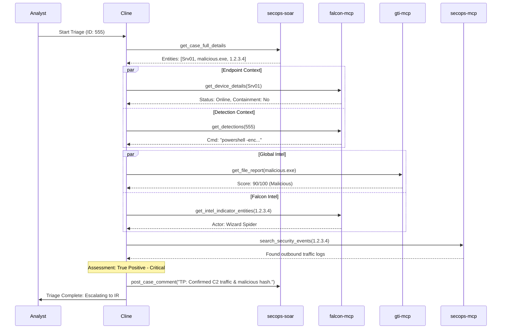

# Runbook: Alert Triage (Falcon Integrated - Direct Execution)

## Objective
To provide a direct, standardized process for the initial assessment of security alerts by leveraging **CrowdStrike Falcon** telemetry, SIEM logs, and SOAR orchestration without external modular dependencies.

## Scope
Covers direct alert context gathering, endpoint status verification, threat intelligence lookups, and final assessment. Excludes duplicate checking and modular "common step" scripts.

## Tools
*   **`secops-soar`**: `get_case_full_details`, `list_alerts_by_case`, `post_case_comment`, `change_case_priority`, `siemplify_close_case`
*   **`falcon-mcp`**: 
    *   `get_detections`: Detailed alert metadata (TTPs, file paths, command lines).
    *   `get_device_details`: Host status, isolation state, and system info.
    *   `get_intel_indicator_entities`: CrowdStrike's proprietary threat intel for IOCs.
    *   `query_detections`: Find related detections on the same host or via same behavior.
*   **`secops-mcp`**: `search_security_events` (SIEM search for log correlation).
*   **`gti-mcp`**: `get_file_report`, `get_domain_report`, `get_ip_address_report`, `get_url_report`.

---

## Workflow Steps

### 1. Receive & Initialize
*   Obtain `${ALERT_ID}` or `${CASE_ID}`.
*   Execute `secops-soar.get_case_full_details` to identify `KEY_ENTITIES` (IPs, Hashes, Hostnames, Users).

### 2. Falcon Detection Context
*   If the alert originates from CrowdStrike, use the `Detection ID` with `falcon-mcp.get_detections`.
*   **Identify**: 
    *   `tactic` & `technique` (MITRE mapping).
    *   `filename` & `command_line` of the triggering process.
    *   `parent_details` to understand the process tree.

### 3. Endpoint & Asset Verification (Falcon)
*   For any identified `hostname` or `device_id`:
    *   Execute `falcon-mcp.get_device_details`.
    *   **Verify**: Is the host `contained` (isolated)? What is the OS version? Is it a critical server?
*   Execute `falcon-mcp.query_detections` using the `device_id` to see if this host has a history of recent, related detections.

### 4. Direct Enrichment (GTI & Falcon Intel)
*   **For File Hashes**: Call `gti-mcp.get_file_report` AND `falcon-mcp.get_intel_indicator_entities`. Compare the global reputation (GTI) with Falcon’s actor-specific intel.
*   **For IPs/Domains**: Call `gti-mcp.get_ip_address_report` and `falcon-mcp.get_intel_indicator_entities`.
*   **Search SIEM**: Use `secops-mcp.search_security_events` to look for the `KEY_ENTITIES` in firewall, proxy, or VPN logs to see if the threat has moved beyond the endpoint.

### 5. Initial Assessment
*   Evaluate findings based on:
    *   **Falcon Confidence/Severity**: Is the detection "High" confidence?
    *   **Process Line**: Is the command line typical for an administrator or suspicious (e.g., encoded PowerShell)?
    *   **Intel Results**: Is the IOC associated with a known threat actor?
*   **Classify as**: False Positive (FP), Benign True Positive (BTP), or True Positive/Suspicious (TP).

### 6. Final Documentation & Action
*   **If FP/BTP**:
    *   Execute `secops-soar.post_case_comment` with a detailed rationale (e.g., "Confirmed as authorized IT maintenance script").
    *   Execute `secops-soar.siemplify_close_case` using reason `NOT_MALICIOUS`.
*   **If TP/Suspicious**:
    *   Execute `secops-soar.change_case_priority` if the Falcon severity is High/Critical.
    *   Execute `secops-soar.post_case_comment` summarizing the Falcon process tree and Intel hits.
    *   Escalate to Tier 2 or the Incident Response team.

---

## Workflow Diagram (Mermaid)

## Completion Criteria
- [x] Full Falcon detection metadata (Command line/Parent process) retrieved.
- [x] Endpoint isolation status and OS details confirmed via `falcon-mcp`.
- [x] Dual-source enrichment (GTI + Falcon Intel) completed for all IOCs.
- [x] SIEM log correlation performed for network-level visibility.
- [x] Case updated in SOAR with clear "Close" or "Escalate" decision.
- [x] All tool outputs and decisions logged in case comments.
