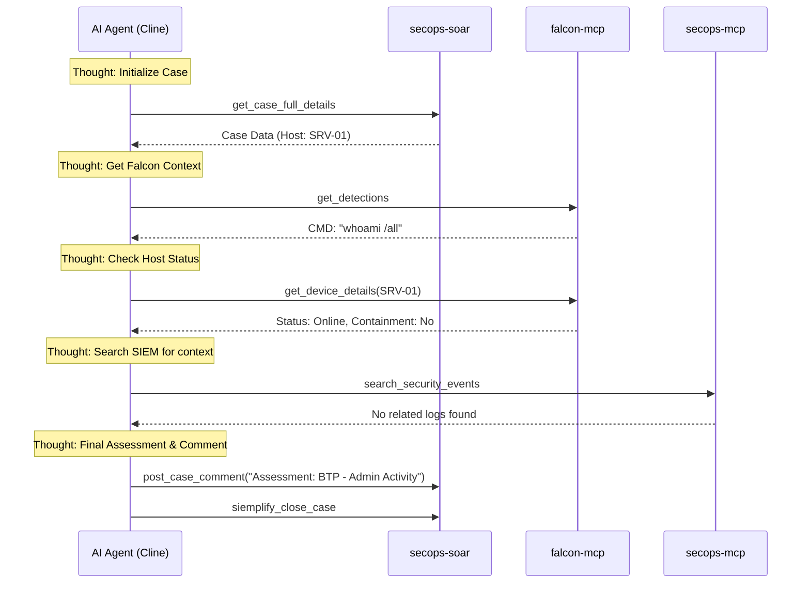

# Runbook: Alert Triage (Falcon & SOAR - Vertex AI Compatible)

## Objective
To provide a standardized triage process for security alerts by integrating **CrowdStrike Falcon** telemetry, **GTI** intelligence, and **SOAR** orchestration, ensuring every tool call is preceded by a clear reasoning step.

## Tools
*   **`secops-soar`**: `get_case_full_details`, `post_case_comment`, `change_case_priority`, `siemplify_close_case`
*   **`falcon-mcp`**: `get_detections`, `get_device_details`, `get_intel_indicator_entities`, `query_detections`
*   **`secops-mcp`**: `search_security_events`
*   **`gti-mcp`**: `get_file_report`, `get_ip_address_report`

---

## Workflow Steps

### Step 1: Initialize Case Context
**Thought:** I need to retrieve the full context of the case to identify the involved entities (IPs, hostnames, hashes) and the source of the alert.
*   **Action:** Call `secops-soar.get_case_full_details` using `${CASE_ID}`.

### Step 2: Extract Falcon Metadata
**Thought:** Since this alert involves endpoint activity, I need to check if there is a CrowdStrike Detection ID. If found, I will retrieve the process tree and command line to understand the execution context.
*   **Action:** Call `falcon-mcp.get_detections` using the ID found in Step 1.

### Step 3: Verify Endpoint Status
**Thought:** I need to determine the current state of the affected host. If the host is already contained, the risk is lower. If it is a critical server and still online, I need to prioritize it.
*   **Action:** Call `falcon-mcp.get_device_details` for the identified `hostname` or `device_id`.

### Step 4: Multi-Source Enrichment (IOCs)
**Thought:** I will now verify the reputation of any file hashes or IP addresses. I will use both GTI for global reputation and Falcon Intel for specific threat actor attribution.
*   **Action 1 (Global):** Call `gti-mcp.get_file_report` or `get_ip_address_report`.
*   **Action 2 (CrowdStrike):** Call `falcon-mcp.get_intel_indicator_entities` for the same IOCs.

### Step 5: SIEM Correlation
**Thought:** To see if the activity has spread beyond the endpoint (e.g., network lateral movement or successful C2), I will search the broader security logs.
*   **Action:** Call `secops-mcp.search_security_events` searching for the `KEY_ENTITIES` across the last 24 hours.

### Step 6: Documentation & Decision
**Thought:** I have gathered the process tree (Falcon), the host status, and the threat reputation. I will now document these findings in the SOAR case and determine if the alert should be closed or escalated.
*   **Action (Comment):** Call `secops-soar.post_case_comment` with a summary of findings.
*   **Action (Final):** Call `secops-soar.siemplify_close_case` (if FP/BTP) or `change_case_priority` (if TP/Suspicious).

---

## Workflow Diagram (Mermaid)

---

## Rubric for Execution

1.  **Reasoning Pattern (Required):** Did the agent provide a "Thought" block before **every** tool call to satisfy Vertex AI requirements?
2.  **Falcon Integration:** Did the agent utilize `get_detections` and `get_device_details`?
3.  **Cross-Reference:** Did the agent compare Falcon Intel with GTI results?
4.  **Actionable Outcome:** Did the agent end with a clear comment and a closure/escalation action in the SOAR?
